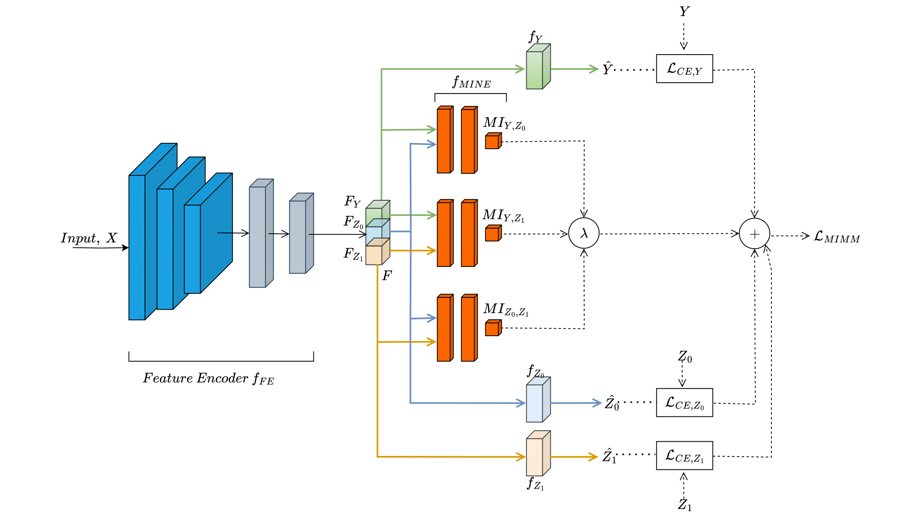

|                             |
|:-------------------------------------------------:|
|             **Universität Stuttgart**             |
| Institut für Signalverarbeitung und Systemtheorie |
|               Prof. Dr.-Ing. B. Yang              |
|                        |

# Resarch thesis

# Avoiding Shortcut-Learning through Mutual Information Minimization for Datasets with Multiple Confounding Variables
                  
## Abstract
 
Deep learning methodologies rely on the ability to leverage relationships between features within datasets to extract meaningful representations. However, confounding variables can introduce spurious or meaningless correlations into the dataset, leading to biases in deep learning models. The mutual information minimization model successfully learns causal relationships from datasets with a single confounding variable. This thesis proposes an extension of the concept for datasets with multiple confounding variables. A detailed study of the mutual information neural estimation and an exploration of the causal structure of datasets with multiple confounding variables have been done for this. The proposed model has been tested on two datasets - a benchmark Morpho-MNIST dataset and a medical CheXpert dataset. The experiments performed validate the success of the model in learning true causal relationships from datasets with multiple confounding variables.

## Thesis

## Presentation

