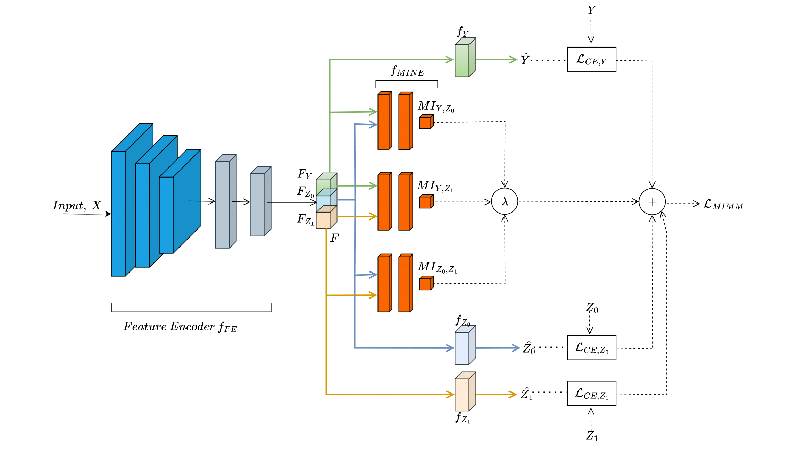
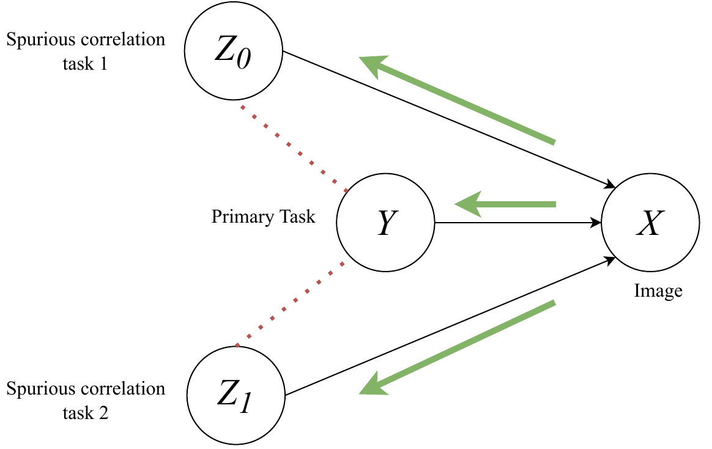
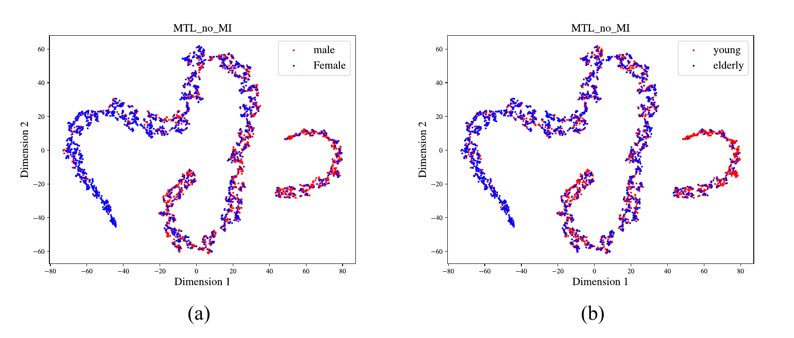
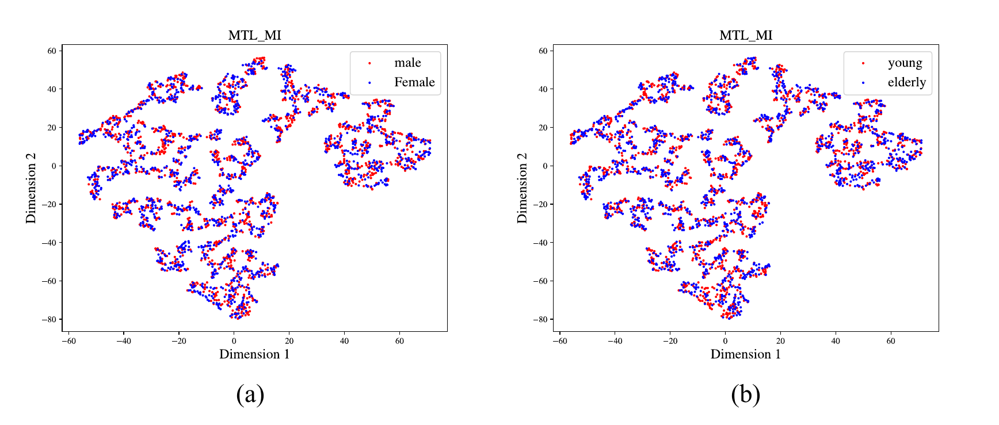

**Universität Stuttgart**

Institut für Signalverarbeitung und Systemtheorie

Prof. Dr.-Ing. B. Yang

# Resarch thesis

# Avoiding Shortcut-Learning through Mutual Information Minimization for Datasets with Multiple Confounding Variables
                  
## Abstract
 
Deep learning methodologies rely on the ability to leverage relationships between features within datasets to extract meaningful representations. However, confounding variables can introduce spurious or meaningless correlations into the dataset, leading to biases in deep learning models. The mutual information minimization model successfully learns causal relationships from datasets with a single confounding variable. This thesis proposes an extension of the concept for datasets with multiple confounding variables. A detailed study of the mutual information neural estimation and an exploration of the causal structure of datasets with multiple confounding variables have been done for this. The proposed model has been tested on two datasets - a benchmark Morpho-MNIST dataset and a medical CheXpert dataset. The experiments performed validate the success of the model in learning true causal relationships from datasets with multiple confounding variables.

## Causal Structure

The image X is caused by the primary label Y(disease label) and confounders Z₀ (eg. sex), Z₁(eg. age). The green arrows show the direction of prediction, the model predicts Y, Z₀, and Z₁ from X. The red dotted lines indicate the spurious correlations between the primary task and the confounders that the model must avoid learning by minimizing the mutual information between the tasks.

<table align="center"><tr>
<td></td>
<td></td>
</tr></table>

## Results: t-SNE Visualizations

t-SNE plots of the primary task feature vectors on the CheXpert dataset, colored by confounder label (sex: male/female, age: young/elderly). **Clear cluster separation** indicates the model has learned the spurious correlation, its features encode the confounder. **No clear separation** (interleaved colors) indicates the model learned to represent the primary task without relying on the confounding variables, which is the desired outcome of MI minimization.

**Baseline: no MI minimization (features encode sex and age confounders)**

**MIMM: with MI minimization (features disentangled from sex and age)**

## Thesis

## Presentation

